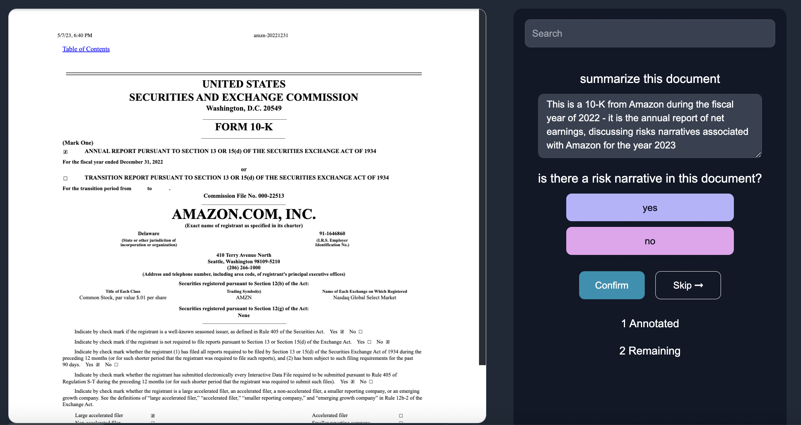

## Impact

At Anote, we are able to render our AI technology on a interactive user interface to help analysts extract information from 10-Ks:

As the user answers a question from one 10-K, we are able to incorporate feedback to provide better answers on the next 10-K.

We iterate on this process refining the answers to queries based on human feedback. This technology can have a massive impact, making analysis of 10-Ks more time efficient, less expensive in a scalable and accurate way, as seen below.

#### Time Efficiency

The introduction of Anote's technology can analyze vast amounts of data 10 times faster than human analysts, equating to an annual saving of approximately 10,000 person-hours.

#### Cost Savings:

By reducing the labor hours associated with manual data extraction and analysis, the automated approach directly translates to massive cost savings. On average, the introduction of automation can save up to $500,000 per year.

#### Improved Accuracy

With this technology, one can obtain an accuracy rate of 88% in information extraction tasks. This level of precision is vital, especially considering the potentially major financial ramifications of inaccuracies within these intricate documents.

#### Scalability

As a company grows and the number of 10-K documents it needs to analyze increases, our system can handle larger volumes of data without compromising on speed or accuracy, making it a sustainable solution for businesses of all sizes.

#### Conclusion

The use of Anote's technologies to decipher and extract information in 10-Ks provides a level of efficiency, accuracy, and cost-effectiveness that outpaces traditional manual analysis. This can help make the job of many financial analysts a lot easier.