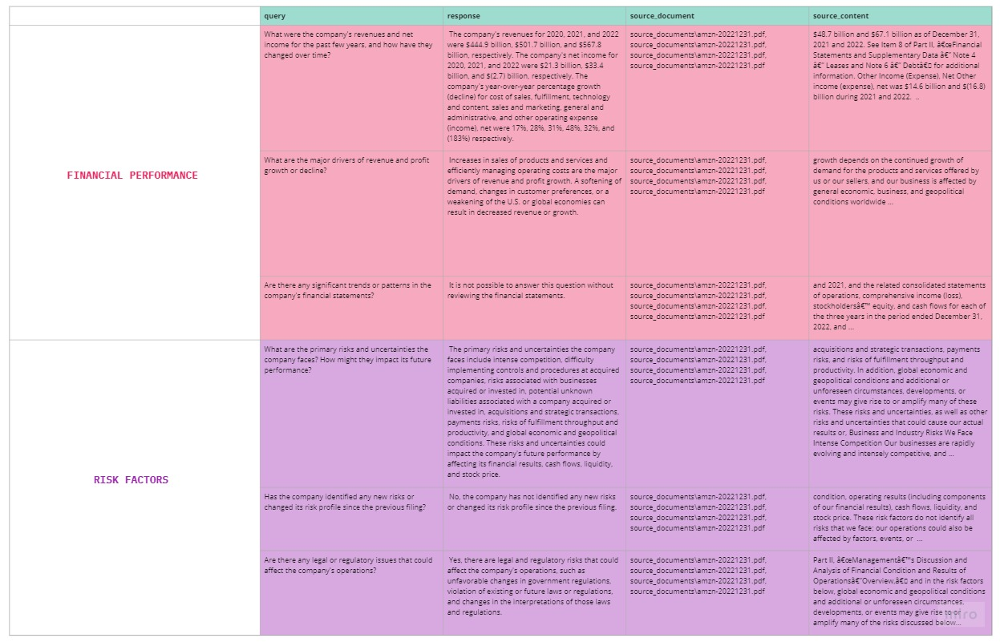
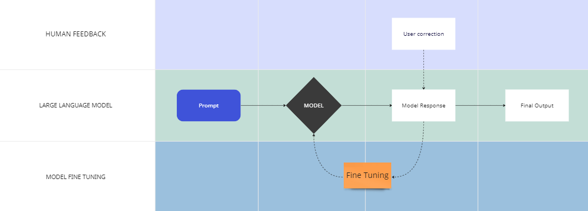
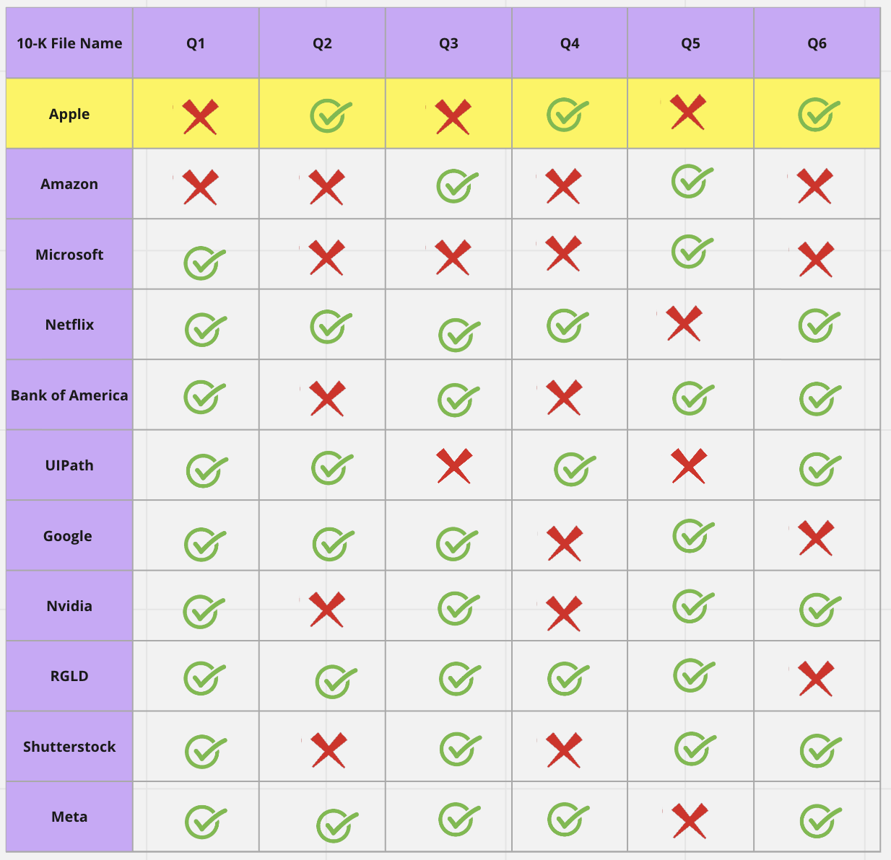
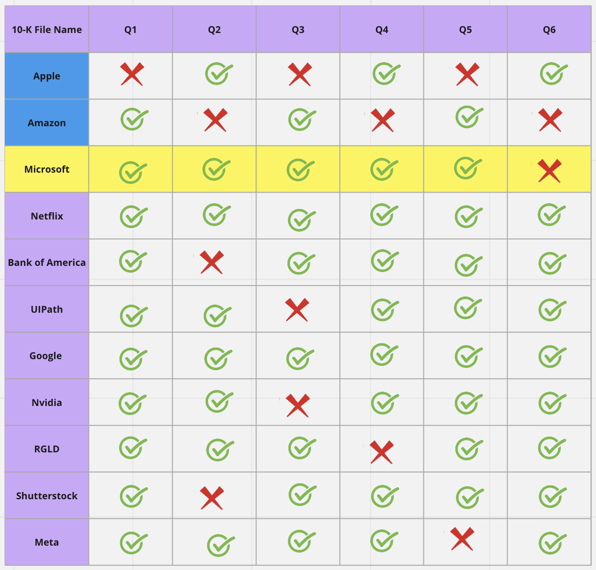

### Incorporating Human Feedback for Prompting

Each 10-K document carries its unique information of characteristics and nuances, shaped by the company's industry, operations, and strategic direction. For instance, the Amazon 10-K may lay emphasis on its e-commerce and cloud computing operations, while Apple's report might be filled with details about its innovative consumer electronic devices, and Netflix may underline its content production and subscription-based streaming services.

This inherent diversity means analysts, or AI models in this context, often have to reprompt or adjust their approach for each new document, fine-tuning the extraction process for better accuracy. This manual intervention can be time-consuming, reducing the overall efficiency of the data extraction process.

But, what if there was a way to eliminate this repetitive cycle of reprompting and refactoring? What if there was a solution that could generalize the annotator feedback, allowing the model to learn and adapt from a few human interventions and apply this knowledge across all your 10-Ks?

### The Anote Solution

At Anote, you can start uploading your 10-K documents using our user-friendly interface shown below. Once the documents are uploaded, our powerful backend utilizes machine learning algorithms to extract the most relevant information in a matter of seconds. This information could include the title of the company, trading letters, current executives and key people, total assets, and revenue.

However, extracting domain-specific information requires a more sophisticated approach than simple machine learning models. At Anote, we provide a solution where users can ask pre-defined domain-specific questions. For example, financial analysts might be interested in the following important questions:

**Financial Performance**

1. What were the company's revenues and net income for the past few years, and how have they changed over time?
2. What are the major drivers of revenue and profit growth or decline?
3. Are there any significant trends or patterns in the company's financial statements?

**Risk Factors**

1. What are the primary risks and uncertainties the company faces? How might they impact its future performance?
2. Has the company identified any new risks or changed its risk profile since the previous filing?
3. Are there any legal or regulatory issues that could affect the company's operations?

Anote not only returns the best-fit answers to the questions but also provides information on the source file and source contents from which the response was formulated. Users can access the final outcome through the Anote interface and make changes if needed, or download the results for further analysis on their local machine.

### Model Fine Tuning and Human Feedback

Large language models can make mistakes when operating under domain-specific conditions, such as analyzing 10-Ks. As we have seen before, when we ask a set of six questions, the model could make mistakes in 3 out of 6 cases. This is one of the challenging issues when analyzing 10-Ks. However, Anote leverages human feedback to fine-tune the large language model.

In a nutshell, users can modify the output of the initial questions and provide feedback to the model. The model can be one of the large language models such as OpenAI, Llama, or GPT4All. The fine-tuned model learns from human feedback and improves its performance when analyzing the next set of documents.

For example, when we ask the initial set of six questions using Apple's 10-K document, we may get correct answers for only 3 out of the 6 questions. The user can then correct questions 1, 3, and 5. The model receives human feedback and modifies its structure to identify the next set of 6 questions from the next document, such as Amazon's 10-K.

As we can see from the Amazon example, the model now returns correct answers for questions 1, 3, and 5. However, it still returns wrong answers for questions 2, 4, and 6. In a similar manner, the user can correct these responses, and the model will be further fine-tuned.

    

When the model is applied again to the next document, such as Microsoft's 10-K, it correctly answers 5 out of the 6 questions. As we continue to correct errors encountered during the analysis, we fine-tune the model, allowing it to learn from human feedback and improve its performance with each subsequent step.

By labeling more outputs as we analyze more documents, the model can actively learn from human feedback and improve over time. After just a few human interventions, our model is able to pick up correct answers for many of the rest of the 10-Ks. This iterative process significantly enhances the accuracy and quality of the output, saving time for the user / analyst.