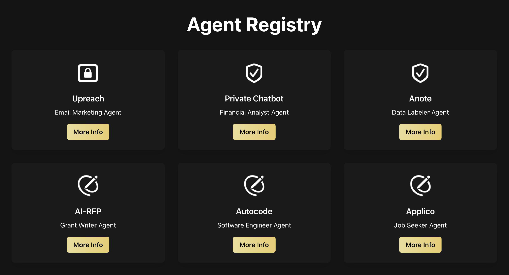

# Introduction
Autonomous Intelligence is an open-sourced, research-driven initiative aimed at building collaborative multi-agent AI systems. By combining modular design principles and cutting-edge machine learning techniques, this project empowers developers and organizations to build, deploy, and optimize AI agents that work well in dynamic, complex environments.

### General Purpose Multi-Agent AI Framework

The framework provides a robust infrastructure for creating and managing multiple AI agents. It enables seamless collaboration between agents to tackle complex tasks, dynamically adapting to user inputs and changing conditions.

### Domain Specific Agent Registry

The registry offers a catalog of prebuilt agents optimized for specific domains, such as coding, data analysis, and natural language processing. This allows users to quickly integrate tailored solutions into their workflows without extensive setup.

