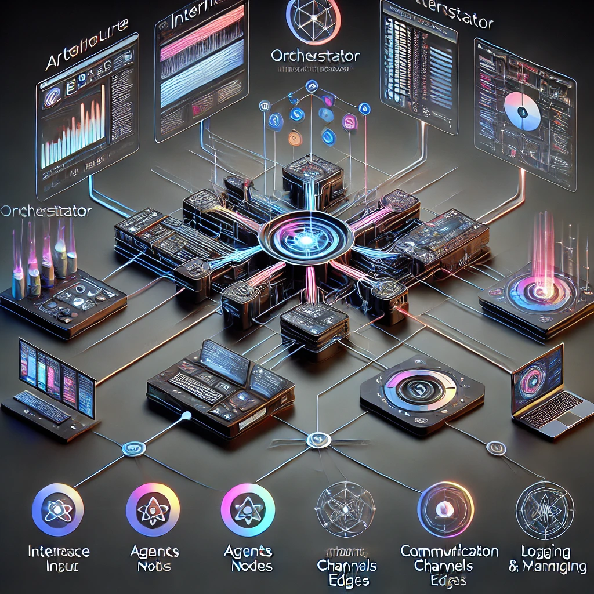

# System Architecture Overview

Panacea's architecture is built around a decentralized network of specialized agents that work both independently and collaboratively. These agents communicate through defined pathways, managed by an orchestrator that ensures tasks are distributed and executed efficiently. The system is designed for scalability, resilience, and adaptability, allowing for the addition of new agents and functionalities as requirements evolve.

## Architecture Diagram

**Key Highlights:**

- **Decentralized Agents**: Each agent operates autonomously while collaborating to achieve complex tasks.

- **Orchestrator**: Acts as the central command center, managing task distribution and workflow coordination.

- **Communication Channels (Edges)**: Enable seamless data exchange and coordination between agents.

- **Logging & Monitoring**: Ensure transparency, performance tracking, and issue resolution.
