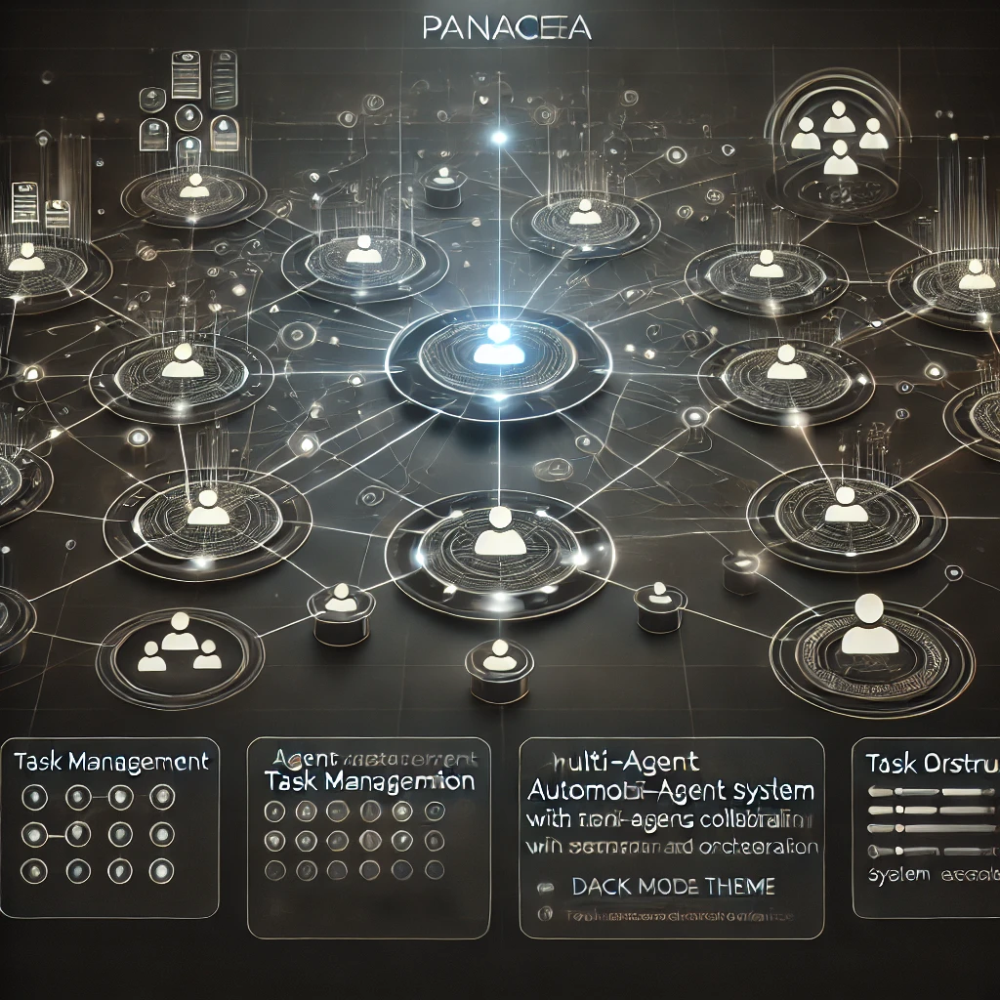

# Orchestration

The orchestrator plays a pivotal role in managing workflows. It interprets user queries, breaks them down into actionable tasks, and assigns these tasks to the appropriate agents. The orchestrator ensures that tasks are distributed efficiently, optimizing workflow execution and ensuring timely completion.

## Orchestration Process

1. **Query Interpretation**: The orchestrator parses the natural language query to understand the user's intent and extract relevant entities.
2. **Task Breakdown**: The query is decomposed into smaller, manageable tasks that can be assigned to individual agents.
3. **Task Assignment**: Tasks are allocated to the appropriate agents based on their specialization and current workload.
4. **Monitoring and Adjustment**: The orchestrator monitors task execution, making adjustments as necessary to handle delays or errors.

## Orchestrator Features

- **Intelligent Routing**: Utilizes AI to determine the most efficient agent for each task.
- **Dynamic Scaling**: Adjusts the number of active agents based on task volume and complexity.
- **Failure Recovery**: Implements strategies to recover from agent failures, ensuring workflow continuity.
- **Performance Optimization**: Continuously analyzes workflow performance to identify and eliminate bottlenecks.
