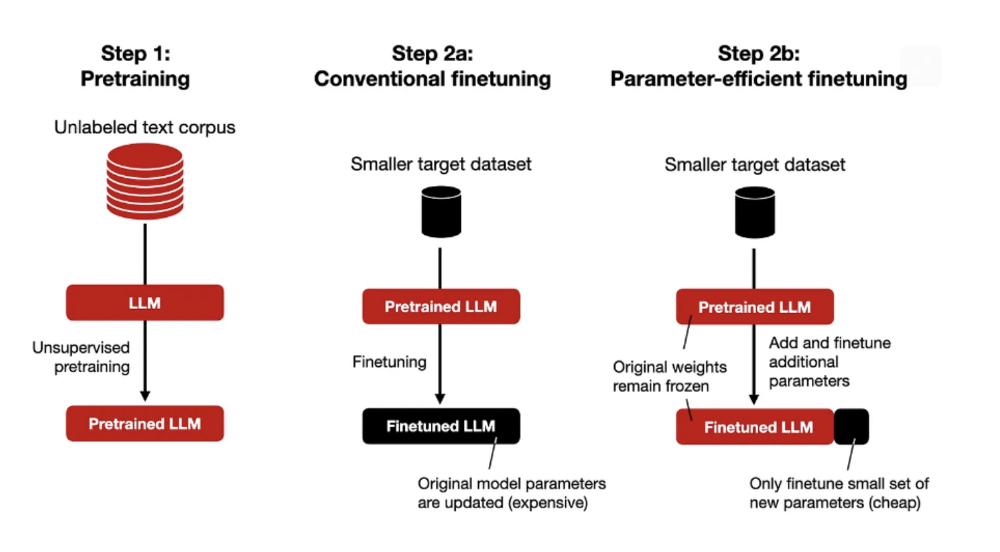
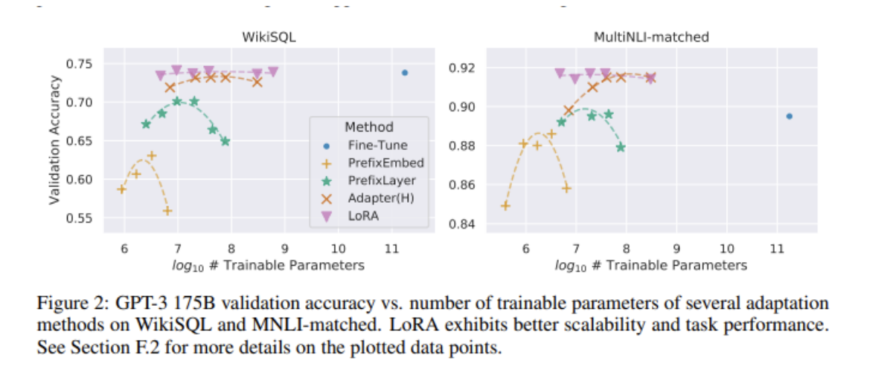

# Supervised Fine Tuning Methods

Supervised Fine-tuning is when the training data consists of paired input and outputs of various examples
that demonstrate how you want the model to respond to certain queries. By fine-tuning the model, we
aim to get the model to mimic the style of the training data when asked questions similar to those in the data. Since our goal for the fine-tuned model was to be good at answering questions on financial documents, our training data consisted of a set of questions and answers curated by human financial experts. The datasets we employed were meant for supervised fine-tuning as they consisted of a question, context, and answer column.

### Parameter Efficient Fine Tuning
Parameter Efficient Fine Tuning (PEFT) is a method that significantly reduces the amount of compute and memory required for Fine Tuning LLMs. Instead of retraining and adjusting all the weights, PEFT freezes
all the weights of the pre-trained model and then augments it with additional parameters during the fine
tuning process. This differs from full fine tuning which retrains all the parameter weights, and transfer
learning which only retrains the head of the model. PEFT can result in comparable performance to fully
fine tuned models while having significantly less trainable parameters. It also reduces the risk of a model
forgetting a lot of core material and enables the same base model to be fine tuned for various different
use cases since the all the base pre-trained weights remain fixed.

### LORA
Low Rank Adaptation (LoRA) is a method within PEFT that further reduces the number of trainable
parameters through the use of low-rank matrices. Instead of representing the weights in a d x d matrix
for example, LoRA represents it as the product of (d x r)(r x d), where r is a rank significantly lower
than d. Compared to full fine tuning, LoRA uses 10000 times less trainable parameters and three times
less memory. 5 PEFT with LoRA is significantly less computationally expensive that full fine tuning and
has been proven to result in comparable performance, as seen in Figure 2. Therefore, such techniques
have been widely adapted and the ability to fine tune LLMs for specific use cases has been dramatically
democratized.

### QLORA
QLoRA, or Quantized Low-Rank Adaptation is a method that further increases the efficiency of fine
tuning by significantly reducing the memory required while preserving performance through the use of
quantization. Tensors in these models are usually in 16-bit precision and a quantized model then reduces
the precision and memory of these models, usually to 4-bit precision. QLoRA quantizes each input tensor of the neural network and backpropagates gradients through a this quantized model into Low Rank
Adapters