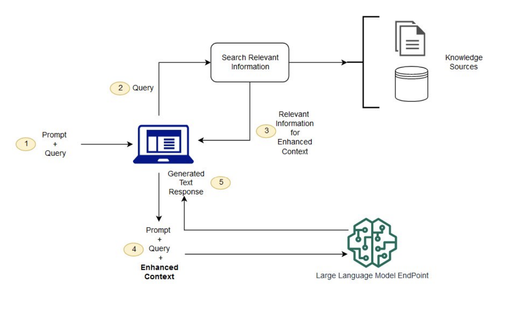

### Retrieval Augmented Generation

Retrieval Augmented generation (RAG) emerges as a crucial process in optimizing the output of large language models. LLMs, with their vast training data and billions of parameters, excel at tasks like question answering, language translation, and sentence completion. However, inherent challenges include the generation of inaccurate or outdated responses, presenting false information, and a lack of adaptability
to current events.



RAG addresses these issues by extending the capabilities of LLMs to reference authoritative knowledge bases outside their training data, enhancing relevance, accuracy, and usefulness in
various contexts. RAG takes an input, retrieves a set of relevant/supporting documents from a source like
for example your textbook pdf, and combines them with the original input prompt. This concatenated
context is then fed to the text generator, producing the final output. This adaptability of RAG becomes
valuable in situations where facts may change over time, a feature particularly useful as the parametric
knowledge of LLMs remains static. RAG eliminates the need for retraining, allowing language models
to access the latest information for generating reliable outputs through retrieval-based generation. introduced in [Retrieval-Augmented Generation for Knowledge-Intensive NLP Tasks](https://arxiv.org/abs/2005.11401)


## Loading Testing Dataset
``` py
from anoteai import Anote

api_key = 'INSERT_API_KEY_HERE'
Anote = Anote(api_key, isPrivate=False)

test_df = pd.read_csv("Bizbench.csv")
```

### Traditional RAG Public
```
for i, row in test_df.iterrows():
    row["rag_answer"], row["rag_chunk"] = Anote.predict(
        model_name="traditional_rag",
        model_type="rag",
        question_text=row["question"],
        context_text=row["context"],
    )

test_df[["id", "rag_answer"]].to_csv("rag_submission.csv")
```

### Traditional RAG Private
``` py
from anoteai import Anote

api_key = 'INSERT_API_KEY_HERE'
Anote = Anote(api_key, isPrivate=True)

test_df = pd.read_csv("Bizbench.csv")
for i, row in test_df.iterrows():
    row["rag_private_answer"], row["rag_private_chunk"] = Anote.predict(
        model_name="traditional_rag_private",
        model_type="rag_private",
        question_text=row["question"],
        context_text=row["context"],
    )

test_df[["id", "rag_private_answer"]].to_csv("rag_private_submission.csv")
```

### RAG Limitations
The RAG model faces many limitations that impact its effectiveness in knowledge-intensive natural language processing tasks. Semantic search, a core component of RAG, exhibits challenges such as retrieving
irrelevant or opposing information, indicating the model’s sensitivity to language nuances and the potential for unexpected results. The ambiguity in understanding how the embedding model extracts and organizes information in vectors adds complexity to optimizing similarity functions. Additionally, the process of chunking, crucial in RAG, can result in information loss if not carefully designed. Below you can see four of the key limitations of RAG, and some of the proposed solutions:

- **Items are located in different sections**
    - For example, if you ask a model to extract all emails in this document, the answer could be on both page 1, page 6 and page 10. Because there are different chunks, retrieving more than one chunk of text and combining the answers can be difficult for RAG to do.
- **Similarity is not relevance**
    - Just because it has the highest similarity to the prompt, doesn’t mean that the chunk is most important or relevant.
        - **HyDE (Hypothetical Document Embeddings):** does query expansion so that rather than just querying the document based on the text, can have the LLM answer the question. From there, you can use FLARE add the LLM answer to the “question” in order to search results in the document.
        - **Reranking algorithms:** uses NLP / ML to rank items based on a relevance score, pick the top k chunks to feed into the LLM as context for the answer
- **Ineffective document chunking**
    - For example, table or sentences can be cut off in half via naive or fixed size chunking, which is a problem unless context windows become very long. To address this, there are a few approaches.
        - **recursive chunking:** dynamically find right chunk / chunk_overlap to avoid cutting sentences off.
        - **element based chunking:** tables, paragraphs, headers, sections each separate chunk
        - **metadata annotations:** filtering, (by date, time, company), add summary, boolean operations
- **Not domain specific**
    - Do fine tuning instead of RAG, or fine tune the embedding algorithm