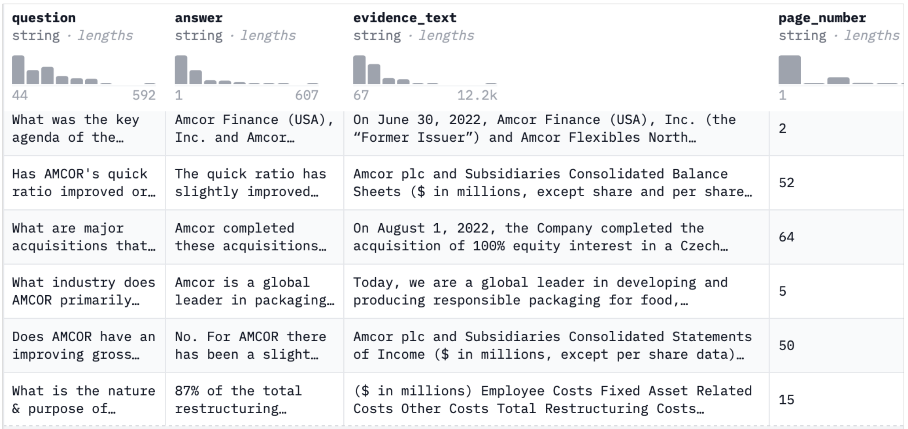
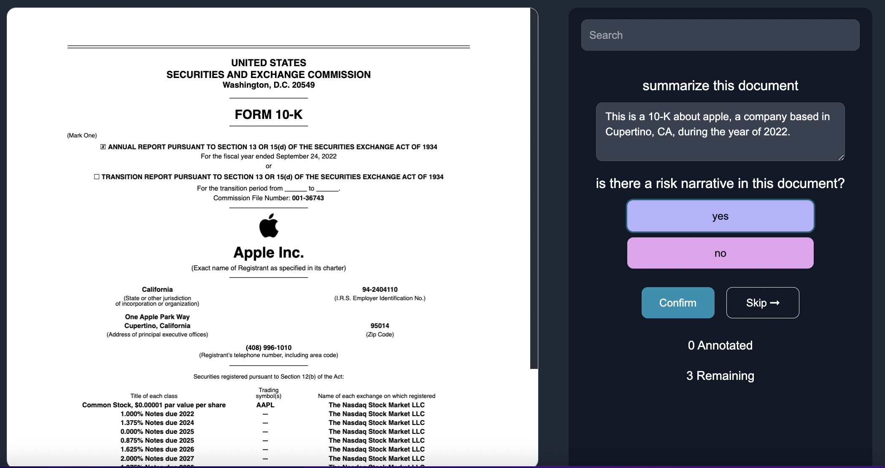

# Overview

The goal is to measure how training and fine tuning question answering models improves the performance of the LLM.

To do this, we evaluate a variety of models across 3 forms of fine tuning:

1. Supervised Fine Tuning
2. Unsupervised Fine Tuning
3. RLHF Fine Tuning

We also evaluate 5 forms of enhanced RAG methodologies:

1. Metadata Filtering
2. Reranking
3. HyDE
4. FLARE
5. Recursive Chunking

We compare the performance of these fine tuned models to the following baseline models:

1. GPT-4
2. Claude
3. Llama3
4. Mistral

We evaluate these LLMs via our evaluation SDK, our evaluation dashboard, and within Kensho's AI Benchmark Tool. These results intend to concretly demonstrate the impact that training and fine-tuning LLMs have on improving model performance both for general LLMs, and within the financial domain specifically.

## Training Datasets Involved

To conduct this research, we will leverage the following training datasets:

### Supervised Fine Tuning Dataset - FinanceBench

FinanceBench is a novel benchmark developed by Patronus AI for evaluating the performance of LLMs on open-book financial question
answering. The dataset is comprised of 10,231 questions about publicly traded companies. Each question is accompanied by corresponding answers and evidence strings. It covers 40 companies in the USA,
spanning 361 public filings, including 10Ks, 10Qs, 8Ks, and Earnings Reports, released between 2015 and 2023. A typical entry contains the question (e.g., “What Was AMCOR’s Adjusted Non-GAAP EBITDA
for FY 2023”), the answer (e.g., “AMCOR’s Adj. EBITDA was 2,018 million USD in FY 2023”), an evidence string (containing information needed to verify the answer), and a page number from the relevant document.

### Unsupervised Fine Tuning Dataset - 10-Ks from EDGAR

Raw unstructured 10-K documents from the [SEC EDGAR filings website](https://www.sec.gov/edgar/searchedgar/companysearch).

### RLHF Dataset - Rag Instruct

RAG Instruct Benchmark tester was designed by LLMWARE to measure the different capabilities of retrieval augmented generation in financial and legal enterprise use cases. The dataset includes 200 questions with context passages pulled from common ’retrieval scenarios’, (e.g., financial news, earnings releases, contracts, invoices, technical articles, general news and short texts). The question span Core Q&A Evaluation, Not Found Classification, Boolean - Yes/No, Math, Complex Q&A and Summary categories.

## Testing Datasets Involved

For our testing dataset, we will use BizBench, a benchmark for evaluating models' ability to reason about realistic financial problems. BizBench comprises eight quantitative reasoning tasks, focusing on question-answering (QA) over financial data via program synthesis. Test dataset includes financially-themed code-generation tasks from newly collected and augmented QA data, as well as the reasoning capabilities required for financial QA: reading comprehension of financial text and tables for extracting intermediate values, and understanding financial concepts and formulas needed to calculate complex solutions. Collectively, these tasks evaluate a model's financial background knowledge, ability to parse financial documents, and capacity to solve problems with code.