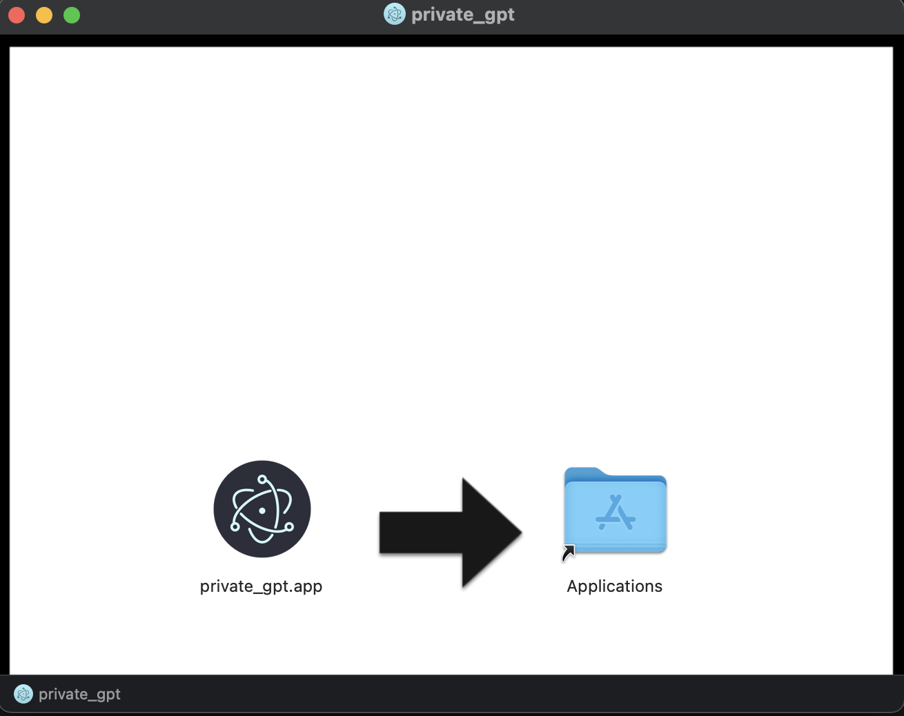

# Installation

## Step 1. Download Anote
Download the Private Chatbot desktop app [here](https://dashboard.Anote.ai/downloadprivategpt)

Open the DMG on your Mac, and follow the on-screen instructions. It should look like below



## Step 2. Download LLMs
Private Chatbot uses [Ollama](https://github.com/ollama/ollama) to manage the LLMs that it uses, LLaMa2 and Mistral.

For Mac, download ollama [here](https://ollama.com/download/Ollama-darwin.zip)

For Windows, download ollama [here](https://ollama.com/download/OllamaSetup.exe)

Then, download LLaMa2 and Mistral by opening your terminal and running

```ollama run llama2```

```ollama run mistral```
